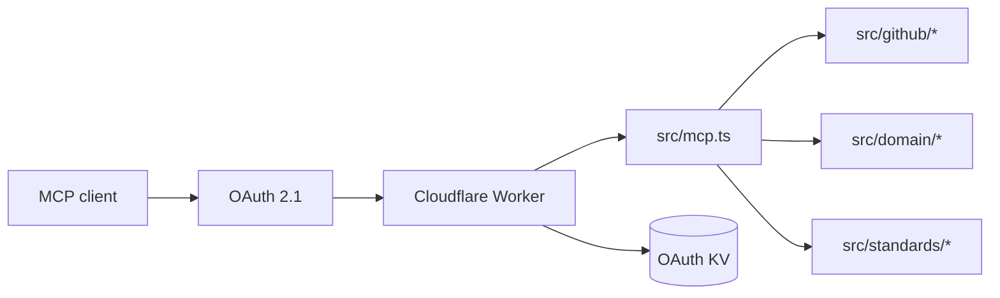

# Shipshape MCP · Know what to fix next

[](https://github.com/aranlucas/shipshape-mcp/actions/workflows/ci.yml)
[](LICENSE)

Shipshape is a read-only MCP server that turns public GitHub repository,
branch, delivery, security, release, and standards signals into a ranked,
evidence-backed maintenance plan. It is the calm second pair of eyes for a
portfolio that has more repositories than a person can inspect manually.

> **A portfolio check in one conversation:** call `portfolio_snapshot`, drill
> into a candidate with `repo_readiness`, then ask for `action_plan`. Shipshape
> turns scattered public signals into a bounded queue of next steps.

<p align="center">
  
</p>

Production endpoint: `https://shipshape-mcp.aranlucas.workers.dev/mcp`

## Connect

```bash
codex mcp add shipshape \
  --url https://shipshape-mcp.aranlucas.workers.dev/mcp \
  --oauth-client-registration auto
```

Available tools include `portfolio_snapshot`, `repo_readiness`, `branch_risk`, `delivery_hygiene`, `security_posture`, `standards_audit`, `settings_drift`, and `action_plan`. Shipshape accepts public repositories only and has no mutation or code-execution capability.

| Tool                 | Use it to                                                           |
| -------------------- | ------------------------------------------------------------------- |
| `portfolio_snapshot` | Find recently active public repositories that need attention.       |
| `repo_readiness`     | Combine publication, default-branch, delivery, and security checks. |
| `branch_risk`        | Inspect protections and merge-safety signals for a branch.          |
| `delivery_hygiene`   | Review commits, pull requests, workflows, and release evidence.     |
| `security_posture`   | Normalize code, dependency, and secret-scanning evidence.           |
| `standards_audit`    | Compare Node, Go, and Python packages with a pinned baseline.       |
| `settings_drift`     | Check repository settings against rules and suggest fix commands.   |
| `action_plan`        | Turn failed and unknown checks into a bounded work queue.           |

The service asks GitHub for public metadata and repository signals through the
GitHub API. It does not clone or execute repository code, and the MCP scope is
read-only.

## Develop

Use Node.js 24 or newer and install the Portless CLI globally:

```bash
npm install -g portless@0.15.7
pnpm install --frozen-lockfile
cp .dev.vars.example .dev.vars
pnpm types
pnpm check
pnpm dev
```

See [`SECURITY.md`](SECURITY.md) for the security boundary and report vulnerabilities privately.

## Shared standards

Use `standards_audit` to check Node, Go, and Python packages against a pinned
engineering baseline. Commit `.shipshape.yml` with
`baseline: shipshape/recommended@1` to adopt it. Shared policies, dated
exceptions, and evidence semantics are documented in [Shared standards](docs/standards.md).

## Settings drift

Use `settings_drift` to declare the GitHub practices you expect: repository
settings, community health files, Actions token permissions and SHA pinning,
dependency review, private vulnerability reporting, active rulesets, and branch
protection. Select repositories with name globs and paginate through every
public repository. Settings drift comes with a `gh api` command; file and
workflow findings include manual steps because Shipshape never edits a
repository. See [Settings drift](docs/settings-drift.md).

The same check is available in the browser at
[`/app`](https://shipshape-mcp.aranlucas.workers.dev/app). Sign in with GitHub,
start new policies with all built-in best-practice checks (team review controls
remain optional), load that starter into saved policies when you want it, see
scan progress and results as repositories finish, save rules to your account,
and copy fix commands from the results.

## Architecture



- `src/index.ts` wires Cloudflare's OAuth provider and the `/mcp` route.
- `src/oauth.ts` and `src/oauth-security.ts` handle GitHub login, PKCE, and
  short-lived OAuth state.
- `src/github/` collects public API evidence and validates response schemas.
- `src/domain/` evaluates checks, scores categories, and builds action plans.
- `src/standards/` collects package manifests and applies the pinned policy.
- `tests/` covers domain scoring, collectors, standards, OAuth, and landing
  pages.

## Local development

After installing Portless as described above, local OAuth testing needs a
GitHub OAuth app and a generated cookie key:

```bash
pnpm install --frozen-lockfile
cp .dev.vars.example .dev.vars
# replace the placeholder values in .dev.vars
pnpm types
pnpm check
pnpm dev
```

`pnpm check` runs type generation, typechecking, linting, formatting, unit
tests, and a `cf deploy --dry-run`. Deploy with `pnpm deploy` only after configuring
the production OAuth secrets and KV binding described in `cloudflare.config.ts`.

Workers Builds runs `pnpm run build`, then `pnpm run deploy:ci` for `main` and
`pnpm run preview` for other branches.

### Named HTTPS development URL

`pnpm dev` exposes the local Worker through
[Portless](https://github.com/vercel-labs/portless/tree/v0.15.7) at a stable name.

Open `https://shipshape-mcp.localhost/app`, or connect an MCP client to
`https://shipshape-mcp.localhost/mcp`. The command runs Vite directly so
Portless can assign its port.

During this command, both OAuth resource metadata and the Worker's
`PUBLIC_ORIGIN` binding use Portless's assigned URL. Register that exact origin
with the local GitHub OAuth application's `/callback` route, which is shared
by MCP and browser logins; keep its client credentials and cookie key in
`.dev.vars`.
Do not set `PUBLIC_ORIGIN` to the production URL in `.dev.vars` for this flow.
Production builds keep the production origin even when `PORTLESS_URL` is
present in the shell. Preview and deployment commands are unchanged.

Portless prefixes the name in a Git worktree; use the printed URL and its
matching OAuth callback, and keep local Worker state in the corresponding
checkout. Its first proxy start can request permission to bind HTTPS and trust
a local certificate. Run `portless doctor` if routing or trust fails; Ctrl-C
stops this Worker and removes its route.

## Status and limits

The public endpoint is deployed at
`https://shipshape-mcp.aranlucas.workers.dev/mcp`. Results describe evidence
visible to the GitHub API at collection time; a missing permission or an
unavailable check is reported as unknown rather than inferred as healthy.
Repositories must be public, and the server cannot modify settings, open
issues, merge code, or run project commands.

### Bounded observation coverage

Delivery counts are observations of the requested branch/window and open pull
requests. `delivery.coverage` records each endpoint's effective page limits,
`fetchedCount`, `nextUrl`, and `complete`, `truncated`, or `unavailable` status.
Counts are `exact` only for an exhausted query; truncated counts (including
subtotals such as failed runs) are lower bounds. Unavailable counts stay null.
A passing workflow sample with unscanned pages leaves CI health unknown;
an observed latest workflow failure remains actionable. Check and action-plan
evidence includes workflow coverage so uncertainty survives summarization.

`portfolio_snapshot.scope` reports the owner-listing coverage, filters, and
selected/omitted eligible repositories. `availableRepositories` remains the
number fetched in the listing, not an owner-wide total when that listing is
truncated. Each ranked result includes its delivery coverage. Explicit collector
selections identify themselves as `explicit` and do not imply a full owner scan.
