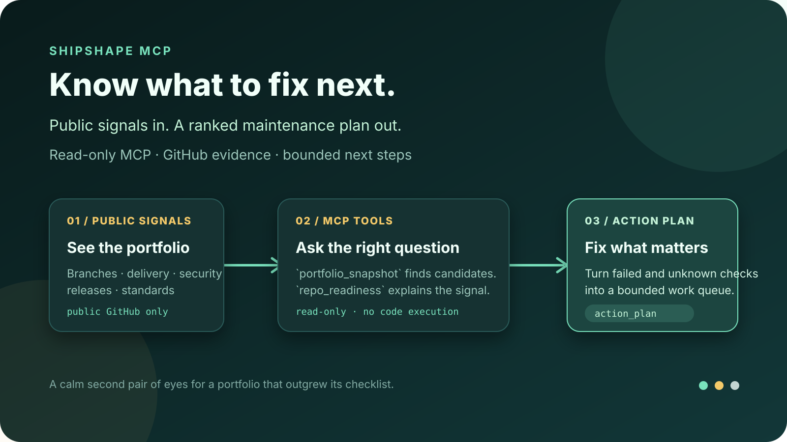
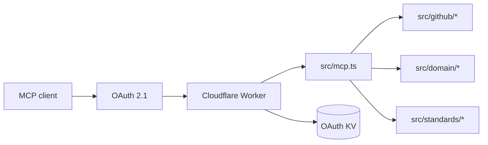

# Shipshape MCP · Know what to fix next

[](https://github.com/aranlucas/shipshape-mcp/actions/workflows/ci.yml)
[](LICENSE)

Shipshape is a read-only MCP server that turns public GitHub repository,
branch, delivery, security, release, and standards signals into a ranked,
evidence-backed maintenance plan. It is the calm second pair of eyes for a
portfolio that has more repositories than a person can inspect manually.

> **A portfolio check in one conversation:** call `portfolio_snapshot`, drill
> into a candidate with `repo_readiness`, then ask for `action_plan`. Shipshape
> turns scattered public signals into a bounded queue of next steps.

<p align="center">
  
</p>

Production endpoint: `https://shipshape-mcp.aranlucas.workers.dev/mcp`

## Connect

```bash
codex mcp add shipshape \
  --url https://shipshape-mcp.aranlucas.workers.dev/mcp \
  --oauth-client-registration auto
```

Available tools include `portfolio_snapshot`, `repo_readiness`, `branch_risk`, `delivery_hygiene`, `security_posture`, `standards_audit`, and `action_plan`. Shipshape accepts public repositories only and has no mutation or code-execution capability.

| Tool                 | Use it to                                                           |
| -------------------- | ------------------------------------------------------------------- |
| `portfolio_snapshot` | Find recently active public repositories that need attention.       |
| `repo_readiness`     | Combine publication, default-branch, delivery, and security checks. |
| `branch_risk`        | Inspect protections and merge-safety signals for a branch.          |
| `delivery_hygiene`   | Review commits, pull requests, workflows, and release evidence.     |
| `security_posture`   | Normalize code, dependency, and secret-scanning evidence.           |
| `standards_audit`    | Compare Node, Go, and Python packages with a pinned baseline.       |
| `action_plan`        | Turn failed and unknown checks into a bounded work queue.           |

The service asks GitHub for public metadata and repository signals through the
GitHub API. It does not clone or execute repository code, and the MCP scope is
read-only.

## Develop

```bash
pnpm install --frozen-lockfile
cp .dev.vars.example .dev.vars
pnpm types
pnpm check
pnpm dev
```

See [`SECURITY.md`](SECURITY.md) for the security boundary and report vulnerabilities privately.

## Shared standards

Use `standards_audit` to check Node, Go, and Python packages against a pinned
engineering baseline. Commit `.shipshape.yml` with
`baseline: shipshape/recommended@1` to adopt it. Shared policies, dated
exceptions, and evidence semantics are documented in [Shared standards](docs/standards.md).

## Architecture



- `src/index.ts` wires Cloudflare's OAuth provider and the `/mcp` route.
- `src/oauth.ts` and `src/oauth-security.ts` handle GitHub login, PKCE, and
  short-lived OAuth state.
- `src/github/` collects public API evidence and validates response schemas.
- `src/domain/` evaluates checks, scores categories, and builds action plans.
- `src/standards/` collects package manifests and applies the pinned policy.
- `tests/` covers domain scoring, collectors, standards, OAuth, and landing
  pages.

## Local development

Local OAuth testing needs a GitHub OAuth app and a generated cookie key:

```bash
pnpm install --frozen-lockfile
cp .dev.vars.example .dev.vars
# replace the placeholder values in .dev.vars
pnpm types
pnpm check
pnpm dev
```

`pnpm check` runs type generation, typechecking, linting, formatting, unit
tests, and a Wrangler dry run. Deploy with `pnpm deploy` only after configuring
the production OAuth secrets and KV binding described in `cloudflare.config.ts`.

## Status and limits

The public endpoint is deployed at
`https://shipshape-mcp.aranlucas.workers.dev/mcp`. Results describe evidence
visible to the GitHub API at collection time; a missing permission or an
unavailable check is reported as unknown rather than inferred as healthy.
Repositories must be public, and the server cannot modify settings, open
issues, merge code, or run project commands.

See [Cloudflare CLI migration](CF_MIGRATION.md) for cf deployment and compatibility details.
